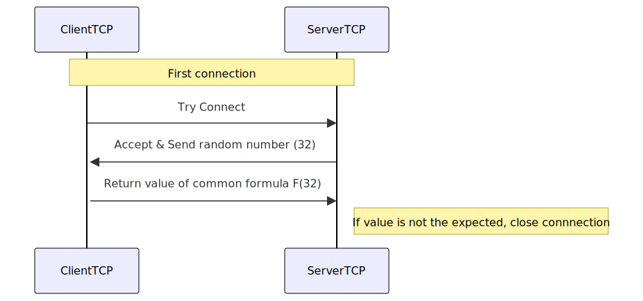
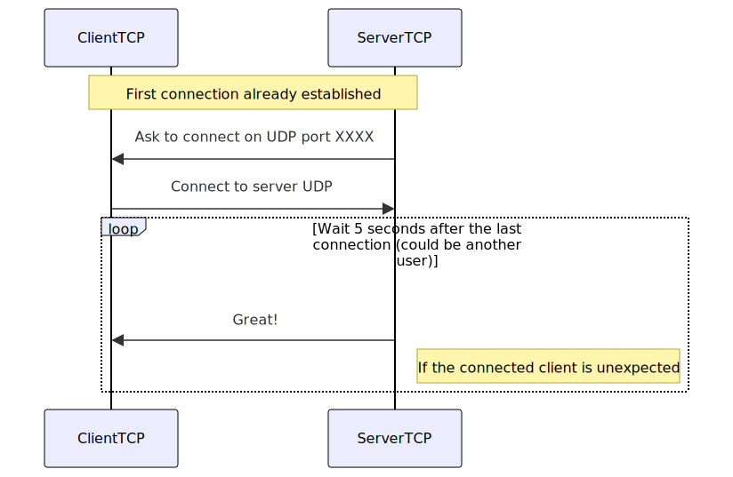

# Protocol

This document outlines the protocol used in the network module. The protocol is designed to be extensible, allowing for the addition of new message types in the future.

## Packet Structure

Each packet consists of a header and a body. The header contains metadata about the packet, while the body contains the actual data being transmitted.

### Header

The header includes the following fields:

- **Type**: (4 bytes) An enumeration value representing the type of the message.
- **Size**: (4 bytes) The size of the body in bytes.

### Body

The body is a sequence of bytes that contains the data for the message. The structure of the body depends on the type of the message.

## Message Types

### SystemMsgTypes

The [`SystemMsgTypes`] enumeration defines the initial set of message types:

- 1 = **ASKUDP_NUMBER**: server sends generated number to client (using TCP)
        
- 2 = **ASKUDP_RESPONSE**: client responds with the transformed number (using UDP) until the server acgnowledges the response (using TCP)

- 3 = **ASKUDP_ACK**: server acknowledges the response (using TCP) This confirms the client that the server linked the UDP port with the TCP connection of the client

- 4...255 = **Reserved**: for future use


### Future Message Types

The protocol is designed to be extensible. New message types can be added to the existing enumeration or a new enumeration can be created to define additional message types. Each new message type should have a corresponding handler to process the message.

- 256...65535 = **Custom Message Types**.

### Custom Message Types

The `RTypePacketType` enumeration defines custom message types used in the ECS module:

- 256 = **PLAYER_VELOCITY**: Sent from client to server to update player velocity and shooting status.
- 257 = **NEW_ENNEMY**: Sent from server to client to notify about a new enemy entity.
- 258 = **BULLET_SHOT**: Sent from server to client to notify about a bullet being shot.
- 259 = **ENTITY_DESTROYED**: Sent from server to client to notify about an entity being destroyed.
- 260 = **PLAYER_CONNECTION_SUCCESS**: Sent from server to client to confirm successful player connection.
- 261 = **PLAYER_STATE**: Sent from server to client to update player state.

### Struct Definitions

The following structs define the data structures for the custom message types:

#### PLAYER_VELOCITY

Sent from client to server to update player velocity and shooting status.

```cpp
struct PlayerVelocityInput {
    float x;
    float y;
    uint8_t shoot;
};
```

#### PLAYER_STATE

Sent from server to client to update player state.

```cpp
struct PlayerState {
    float x;
    float y;
    float vx;
    float vy;
    size_t netId;
};
```

#### NEW_ENNEMY

Sent from server to client to notify about a new enemy entity.

```cpp
struct NewEnnemy {
    float x;
    float y;
    size_t netId;
};
```

#### BULLET_SHOT

Sent from server to client to notify about a bullet being shot.

```cpp
struct BulletShot {
    float x;
    float y;
    uint8_t isPlayer;
    size_t netId;
};
```

#### ENTITY_DESTROYED

Sent from server to client to notify about an entity being destroyed.

```cpp
struct EntityDestroyed {
    size_t netId;
};
```

#### PLAYER_CONNECTION_SUCCESS

Sent from server to client to confirm successful player connection.

```cpp
struct PlayerConnectionSuccess {
    size_t netId;
    unsigned char r;
    unsigned char g;
    unsigned char b;
};
```

## Visual Representation





This protocol ensures a structured and extensible communication mechanism between the server and clients, allowing for future enhancements and additional message types.